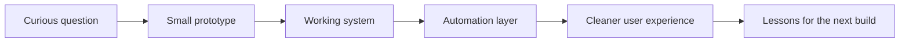

<!-- Profile README for vulkanCommand -->

  

<h1 align="center">Durga Kalyan</h1>

  <b>I build AI systems, automation platforms, mobile apps, and cloud tools that turn rough ideas into working products.</b>

  <a href="https://durgakalyan.com">Portfolio</a> &middot;
  <a href="https://linkedin.com/in/durgakalyan">LinkedIn</a> &middot;
  <a href="mailto:gdkalyan2109@gmail.com">Email</a>

  

---

## Start Here

I am interested in the space where **AI meets infrastructure**: assistants that understand context, automation platforms that create environments on demand, mobile products that make collaboration easier, and cloud systems that make messy workflows feel simple.

Most of my projects start with a question:

| Question | Project Direction |
| --- | --- |
| What if group trips could be planned together without spreadsheet chaos? | **Gotogether Trip Planner** |
| What if temporary workflow environments could launch instantly and disappear cleanly? | **xcommand.cloud / n8n rental infrastructure** |
| What if local development could catch risky `.env` mistakes before they ship? | **Env Guardian** |
| What if a room, screen, or shared space could broadcast content with less friction? | **RoomCast** |

---

## Latest Projects

<table>
<tr>
<td width="50%" valign="top">

### Gotogether Trip Planner

**[gotogether](https://github.com/vulkanCommand/gotogether)**  
Collaborative trip-planning app focused on shared planning, invite flows, and practical group coordination.

Why it matters: travel planning gets hard when everyone has ideas, links, dates, and preferences scattered across chats. Gotogether is built around making that shared planning space feel simple.

Focus: `React Native`, `Go`, `PostgreSQL`, `GCP`, `collaboration UX`

</td>
<td width="50%" valign="top">

### xcommand.cloud

**[xcommand-n8n-rental](https://github.com/vulkanCommand/xcommand-n8n-rental)**  
Temporary workflow workspace platform for launching n8n-style automation environments.

Why it matters: this kind of system needs routing, lifecycle control, isolation, cleanup, and cloud operations instead of just a dashboard.

Focus: `Docker`, `Traefik`, `FastAPI`, `workflow automation`, `cloud infrastructure`

</td>
</tr>
<tr>
<td width="50%" valign="top">

### Env Guardian

**[env-guardian](https://github.com/vulkanCommand/env-guardian)**  
Developer safety tooling for checking environment files and catching configuration risks earlier.

Why it matters: `.env` files sit right on the edge between useful automation and dangerous leaks. Small tools can protect the boring-but-critical parts of development.

Focus: `Go`, `CLI tools`, `developer safety`, `automation`

</td>
<td width="50%" valign="top">

### RoomCast

**[RoomCast](https://github.com/vulkanCommand/RoomCast)**  
Room-focused casting and sharing project for making content visible in a shared space.

Why it matters: shared screens and shared rooms should be easy to control, inspect, and coordinate without turning into a setup puzzle.

Focus: `real-time apps`, `media sharing`, `room-based UX`, `cloud-ready systems`

</td>
</tr>
</table>

---

## Other Work Worth Opening

<table>
<tr>
<td width="50%" valign="top">

### AI Data Systems

**[RooflyticsAI](https://github.com/vulkanCommand/Rooflytics-AI)**  
Natural-language analytics system that turns business questions into SQL-backed answers.

Focus: `PostgreSQL`, `AWS`, `API Gateway`, `Lambda`, `LLM APIs`

</td>
<td width="50%" valign="top">

### Serverless Intelligence

**[AI-File-Analyzer](https://github.com/vulkanCommand/AI-File-Analyzer)**  
File analysis app for uploading PDFs and generating AI summaries.

Focus: `Python`, `AWS Bedrock`, `Lambda`, `API Gateway`

</td>
</tr>
</table>

<b>More experiments</b>

- **[openclaw](https://github.com/vulkanCommand/openclaw)** - personal AI assistant experiment across operating systems and platforms.
- **[gentle-path-main](https://github.com/vulkanCommand/gentle-path-main)** - structured 90-day healing platform concept.
- **[aws-devops-portfolio](https://github.com/vulkanCommand/aws-devops-portfolio)** - hands-on AWS and DevOps lifecycle practice.
- **[SnapFile](https://github.com/vulkanCommand/SnapFile)** - AWS cloud file sharing project.
- **[site-assistant](https://github.com/vulkanCommand/site-assistant)** - assistant-style website experiment.

---

## How I Think

I am not trying to stack technologies. I am trying to build systems that survive contact with real users, real data, and real deployment constraints.

---

## Stack I Actually Reach For

| Area | Tools |
| --- | --- |
| Backend | Python, FastAPI, ASP.NET, Go, REST APIs |
| Mobile | React Native, Expo, deep links, app workflows |
| AI / LLM | OpenAI, Claude, Gemini, RAG, vector databases, AWS Bedrock |
| Cloud / DevOps | AWS, GCP, Docker, Traefik, Prometheus, Grafana |
| Data | PostgreSQL, MySQL, DynamoDB |
| Systems | Linux, Bash, automation-first workflows |
| Frontend | JavaScript, TypeScript, HTML, CSS |

---

## Current Focus

- Building practical AI assistants that understand context and user intent.
- Turning automation ideas into deployable infrastructure, not just demos.
- Shipping collaborative mobile and web products with clear permission boundaries.
- Improving backend architecture, cloud operations, and observability.
- Learning in public through projects, experiments, and sharp iteration.

---

## GitHub Activity

These cards are configured for all-time profile totals where the widget supports it. I avoid year-scoped streak and summary cards here because they can make the profile look like it only represents the current year.

  

  

  

---

## Values

  

  <b>Student Member - Free Software Foundation</b> 
  I care about software that people can inspect, learn from, adapt, and actually understand.

---

## Connect

If you are exploring automation, AI systems, cloud infrastructure, or strange ideas that might become real tools, I am always happy to talk.

  <a href="https://durgakalyan.com"><b>Portfolio</b></a> &middot;
  <a href="https://linkedin.com/in/durgakalyan"><b>LinkedIn</b></a> &middot;
  <a href="mailto:gdkalyan2109@gmail.com"><b>Email</b></a>

