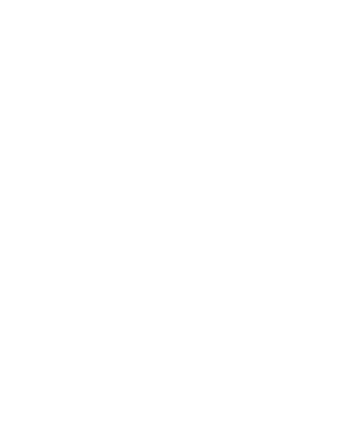
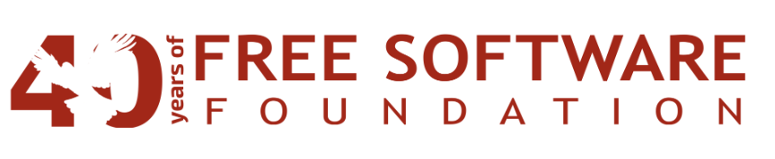

<!-- Header -->

<h1 align="center">Hi, I'm Durga Kalyan 👋</h1>

Engineer who enjoys turning curious ideas into real systems.

---

<table>
<tr>

<td width="34%" valign="top">

</td>

<td width="66%" valign="top">

### My Story

I didn’t become an engineer by following a straight path.

Most of what I know came from curiosity and from building things just to see if they would work.

I started with full stack development, building interfaces and connecting APIs. Over time I became more interested in the systems behind the scenes - backend architecture, cloud infrastructure, automation, and intelligent software.

Many of my projects begin with a simple question.

What if automation could launch entire workflow environments instantly?  
That idea became **xCommand Cloud**.

What if a digital platform could guide someone through a thoughtful healing journey?  
That became **Gentle Path**.

What if AI assistants could feel more contextual and personal?  
That experiment became **Lakshmi**.

Today I work as an **AI Research Intern**, exploring how large language models and automation can help organizations operate more efficiently.

At the core, I enjoy turning small ideas into real systems.

</td>

</tr>
</table>

---

# 🧰 Tech Stack

## Languages

---

## Backend & APIs

---

## AI / LLM / Automation

---

## Cloud & DevOps

---

## Databases

---

## Systems

---

# 🚀 Projects

### xCommand Cloud
Automation platform that launches **temporary n8n workspaces instantly** using Docker, FastAPI, and Traefik.

### Gentle Path
A structured **90-day healing platform** helping users move through emotional recovery.

### Lakshmi
Experimental **AI personal assistant** exploring contextual AI interaction.

### RooflyticsAI
AI analytics system that converts **natural language questions into SQL insights**.

### AI File Analyzer
Serverless document intelligence system using **AWS Bedrock, Lambda, and API Gateway**.

---

# 📊 GitHub Activity

---

# 🐍 Contribution Snake

---

## 🌱 Community

 

<b>Student Member - Free Software Foundation</b>

---

# 🌐 Connect

Portfolio  
https://durgakalyan.com  

LinkedIn  
https://linkedin.com/in/durgakalyan  

Email  
gdkalyan2109@gmail.com
