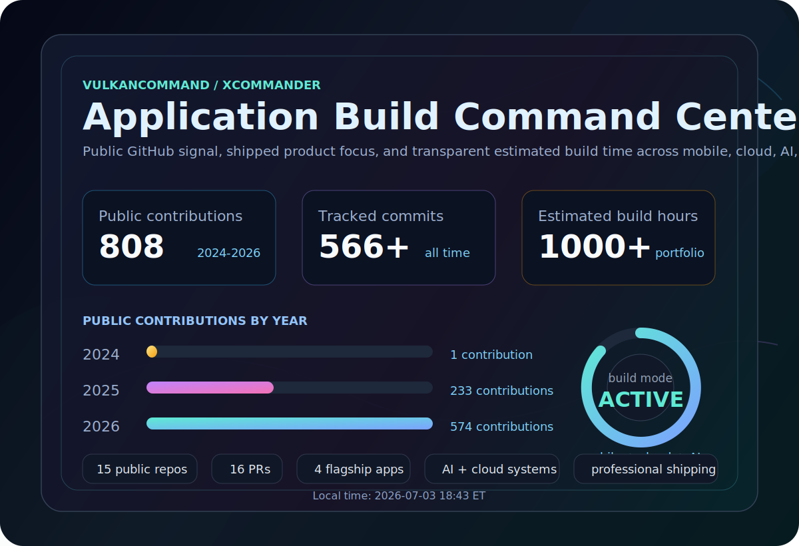

<!-- Profile README for vulkanCommand -->

  

<h1 align="center">Durga Kalyan</h1>

  <b>AI systems builder. Cloud automation engineer. Mobile collaboration maker. Developer-tool operator.</b>

  I build practical software from first principles: mobile apps, cloud automation platforms, AI-backed workflows, developer safety tools, and systems that survive real usage.

  
  
  

  

---

## Command Center

  

  
  
  

  
  

<!-- profile-clock:start -->

  <strong>Local time:</strong> 2026-07-16 06:56 ET

<!-- profile-clock:end -->

Public contribution counts are calendar totals checked for 2024, 2025, and 2026. Estimated build hours are a portfolio signal based on shipped application work, not a GitHub-measured metric.

---

## Flagship Builds

<table>
<tr>
<td width="50%" valign="top">

### Gotogether Trip Planner

**[github.com/vulkanCommand/gotogether](https://github.com/vulkanCommand/gotogether)**  
Collaborative trip-planning product for shared itineraries, invite links, group access, and coordinated travel decisions.

**Signal:** mobile collaboration, backend access control, deep links, production-minded workflows.

`React Native` `Go` `PostgreSQL` `GCP` `Deep links`

</td>
<td width="50%" valign="top">

### xcommand.cloud

**[github.com/vulkanCommand/xcommand-n8n-rental](https://github.com/vulkanCommand/xcommand-n8n-rental)**  
Cloud workspace infrastructure for launching temporary automation environments with routing, isolation, lifecycle control, and cleanup.

**Signal:** real deployment discipline behind automation platforms, not just UI demos.

`Docker` `Traefik` `FastAPI` `Cloud automation` `Workflow infrastructure`

</td>
</tr>
<tr>
<td width="50%" valign="top">

### Env Guardian

**[github.com/vulkanCommand/env-guardian](https://github.com/vulkanCommand/env-guardian)**  
Developer safety tooling for inspecting environment files and catching risky configuration patterns before they become leaks.

**Signal:** practical security hygiene for local development and automation-heavy projects.

`Go` `CLI tools` `Security hygiene` `Developer experience`

</td>
<td width="50%" valign="top">

### RoomCast

**[github.com/vulkanCommand/RoomCast](https://github.com/vulkanCommand/RoomCast)**  
Room-focused casting and sharing experience for making content visible, controlled, and coordinated in shared spaces.

**Signal:** realtime UX thinking, media workflows, and shared-screen product surfaces.

`Real-time UX` `Media sharing` `Room-based workflows` `Cloud-ready apps`

</td>
</tr>
</table>

---

## Engineering Lanes

| Lane | What I Build | Representative Work |
| --- | --- | --- |
| Mobile collaboration | Multi-user apps with invites, roles, shared state, and real workflows | Gotogether, RoomCast |
| Automation infrastructure | Systems that launch, route, monitor, and clean up useful environments | xcommand.cloud |
| AI data systems | Interfaces that connect LLMs to documents, databases, and operational questions | RooflyticsAI, AI File Analyzer |
| Developer safety | Tools that protect secrets, setup, permissions, and deployment edges | Env Guardian |

---

## Stack

  

| Area | Tools I Reach For |
| --- | --- |
| Backend | Go, Python, FastAPI, ASP.NET, REST APIs |
| Mobile | React Native, Expo, deep links, mobile workflows |
| AI / LLM | OpenAI, Claude, Gemini, RAG, vector databases, AWS Bedrock |
| Cloud / DevOps | AWS, GCP, Docker, Traefik, Prometheus, Grafana |
| Data | PostgreSQL, MySQL, DynamoDB |
| Systems | Linux, Bash, GitHub Actions, automation-first workflows |
| Frontend | TypeScript, React, HTML, CSS |

---

## Additional Work

<table>
<tr>
<td width="50%" valign="top">

**[RooflyticsAI](https://github.com/vulkanCommand/Rooflytics-AI)**  
Natural-language analytics system that turns business questions into SQL-backed answers.

`PostgreSQL` `AWS` `API Gateway` `Lambda` `LLM APIs`

</td>
<td width="50%" valign="top">

**[AI-File-Analyzer](https://github.com/vulkanCommand/AI-File-Analyzer)**  
File analysis app for uploading PDFs and generating AI summaries through cloud functions.

`Python` `AWS Bedrock` `Lambda` `Document intelligence`

</td>
</tr>
<tr>
<td width="50%" valign="top">

**[openclaw](https://github.com/vulkanCommand/openclaw)**  
Personal AI assistant experiment across operating systems and local workflows.

`AI assistant` `Local workflows` `Cross-platform experiments`

</td>
<td width="50%" valign="top">

**[aws-devops-portfolio](https://github.com/vulkanCommand/aws-devops-portfolio)**  
Hands-on AWS and DevOps lifecycle practice with infrastructure, deployment, and monitoring.

`AWS` `DevOps` `CI/CD` `Monitoring`

</td>
</tr>
</table>

---

## All-Time GitHub Signal

  

  

  

Hosted stats cards can be cached by their providers. The command-center totals above are written explicitly so the profile still reads clearly when external cards refresh slowly.

---

## Operating Principles

- Ship working systems, then harden the parts that carry real risk.
- Treat permissions, secrets, cleanup, and observability as product features.
- Prefer useful workflows over impressive-looking demos.
- Build in public when the learning itself can help the next project.
- Keep software inspectable, adaptable, and grounded in the user problem.

  

  <b>Student Member - Free Software Foundation</b>

---

## Connect

I am interested in automation platforms, AI systems, cloud infrastructure, mobile collaboration, and product ideas that deserve to become real software.

  <a href="https://durgakalyan.com"><b>Portfolio</b></a> &middot;
  <a href="https://linkedin.com/in/durgakalyan"><b>LinkedIn</b></a> &middot;
  <a href="mailto:gdkalyan2109@gmail.com"><b>Email</b></a>

