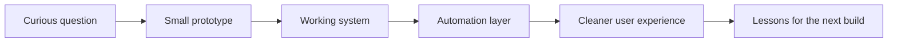

<!-- Profile README for vulkanCommand -->

  

<h1 align="center">Durga Kalyan</h1>

  <b>I build automation, AI systems, and cloud tools that turn rough ideas into working infrastructure.</b>

  <a href="https://durgakalyan.com">Portfolio</a> ·
  <a href="https://linkedin.com/in/durgakalyan">LinkedIn</a> ·
  <a href="mailto:gdkalyan2109@gmail.com">Email</a>

  

---

## Start Here

I am interested in the space where **AI meets infrastructure**: assistants that understand context, automation platforms that create environments on demand, and cloud systems that make messy workflows feel simple.

Most of my projects start with a question:

| Question | Project Direction |
| --- | --- |
| What if workflow environments could launch instantly and disappear cleanly? | **xCommand Cloud / n8n rental infrastructure** |
| What if natural language could become useful business data without a dashboard maze? | **RooflyticsAI** |
| What if file analysis could feel serverless, fast, and cheap to operate? | **AI File Analyzer** |
| What if personal AI assistants were more contextual and less generic? | **Lakshmi / OpenClaw experiments** |

---

## Explore My Work

<table>
<tr>
<td width="50%" valign="top">

### ⚡ Automation Infrastructure

**[xcommand-n8n-rental](https://github.com/vulkanCommand/xcommand-n8n-rental)**  
Temporary workflow workspace platform for launching n8n-style environments.

Why it matters: this is the kind of system that needs routing, lifecycle control, isolation, and cleanup logic instead of just a UI.

Related focus: `Docker`, `Traefik`, `FastAPI`, `workflow automation`

</td>
<td width="50%" valign="top">

### 🧠 AI Data Systems

**[RooflyticsAI](https://github.com/vulkanCommand/Rooflytics-AI)**  
Natural-language analytics system that turns business questions into SQL-backed answers.

Why it matters: the interesting problem is not just calling an LLM. It is making the answer useful, traceable, and connected to real data.

Related focus: `PostgreSQL`, `AWS`, `API Gateway`, `Lambda`, `LLM APIs`

</td>
</tr>
<tr>
<td width="50%" valign="top">

### ☁️ Serverless Intelligence

**[AI-File-Analyzer](https://github.com/vulkanCommand/AI-File-Analyzer)**  
File analysis app for uploading PDFs and generating AI summaries.

Why it matters: document intelligence is only valuable when the pipeline is practical: upload, process, summarize, return.

Related focus: `Python`, `AWS Bedrock`, `Lambda`, `API Gateway`

</td>
<td width="50%" valign="top">

### 🛡️ Developer Tools

**[env-guardian](https://github.com/vulkanCommand/env-guardian)**  
Go-based developer tooling experiment.

Why it matters: I like building small tools that protect the boring-but-dangerous edges of development workflows.

Related focus: `Go`, `CLI tools`, `developer safety`, `automation`

</td>
</tr>
</table>

<b>More experiments worth opening</b>

- **[openclaw](https://github.com/vulkanCommand/openclaw)** - personal AI assistant experiment across operating systems and platforms.
- **[gentle-path-main](https://github.com/vulkanCommand/gentle-path-main)** - structured 90-day healing platform concept.
- **[aws-devops-portfolio](https://github.com/vulkanCommand/aws-devops-portfolio)** - hands-on AWS and DevOps lifecycle practice.
- **[SnapFile](https://github.com/vulkanCommand/SnapFile)** - AWS cloud file sharing project.

---

## How I Think

I am not trying to collect technologies. I am trying to build systems that survive contact with real users, real data, and real deployment constraints.

---

## Stack I Actually Reach For

| Area | Tools |
| --- | --- |
| Backend | Python, FastAPI, ASP.NET, Go, REST APIs |
| AI / LLM | OpenAI, Claude, Gemini, RAG, vector databases, AWS Bedrock |
| Cloud / DevOps | AWS, GCP, Docker, Traefik, Prometheus, Grafana |
| Data | PostgreSQL, MySQL, DynamoDB |
| Systems | Linux, Bash, automation-first workflows |
| Frontend | JavaScript, TypeScript, HTML, CSS |

---

## Current Focus

- Building more practical AI assistants that understand context and user intent.
- Turning automation ideas into deployable infrastructure, not just demos.
- Improving backend architecture, cloud operations, and observability.
- Learning in public through projects, experiments, and sharp iteration.

---

## GitHub Activity

  

  
  

  

---

## Values

  

  <b>Student Member - Free Software Foundation</b> 
  I care about software that people can inspect, learn from, adapt, and actually understand.

---

## Connect

If you are exploring automation, AI systems, cloud infrastructure, or strange ideas that might become real tools, I am always happy to talk.

  <a href="https://durgakalyan.com"><b>Portfolio</b></a> ·
  <a href="https://linkedin.com/in/durgakalyan"><b>LinkedIn</b></a> ·
  <a href="mailto:gdkalyan2109@gmail.com"><b>Email</b></a>

